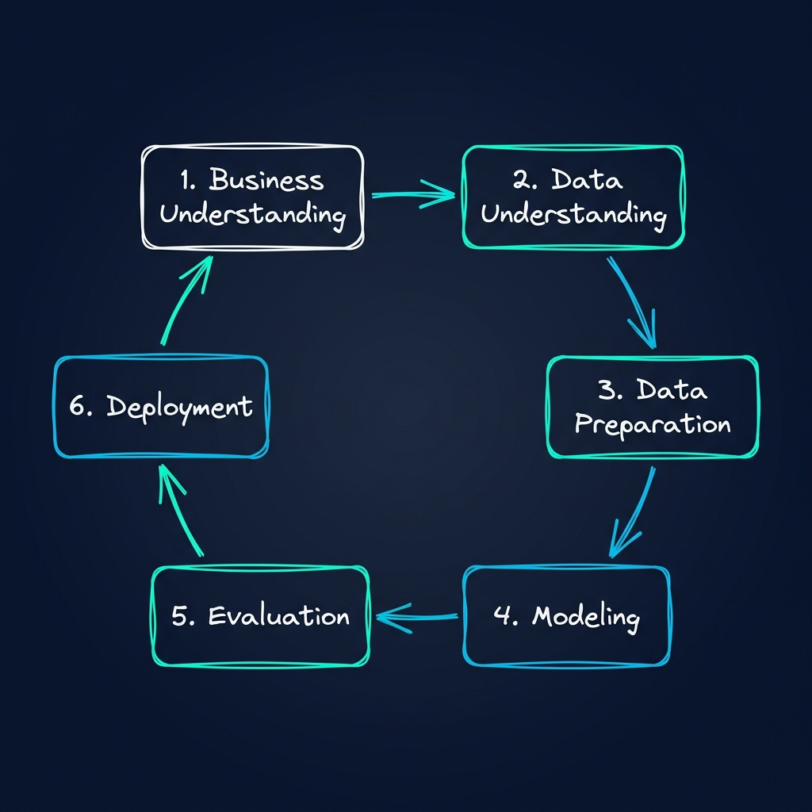
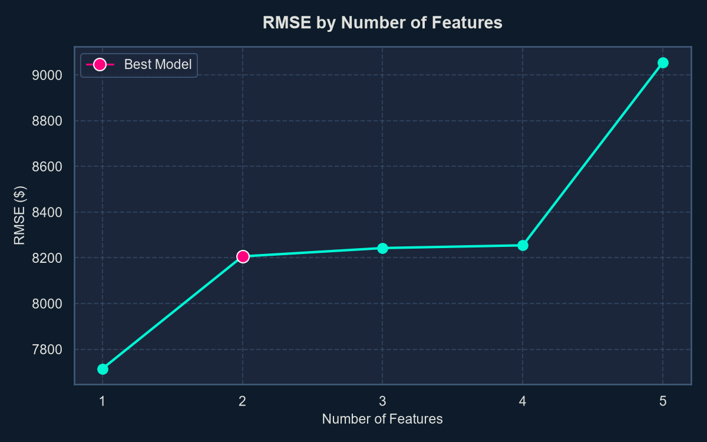
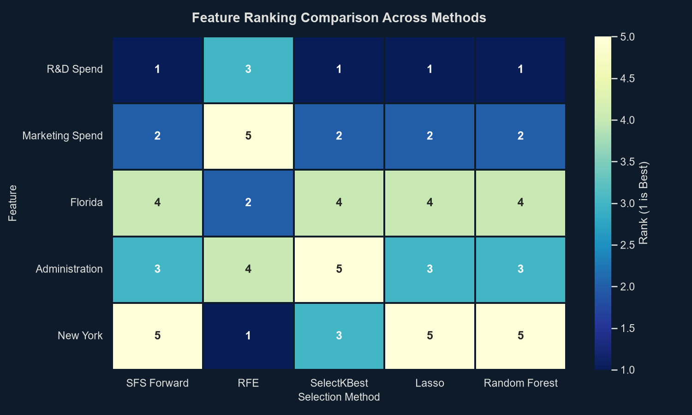
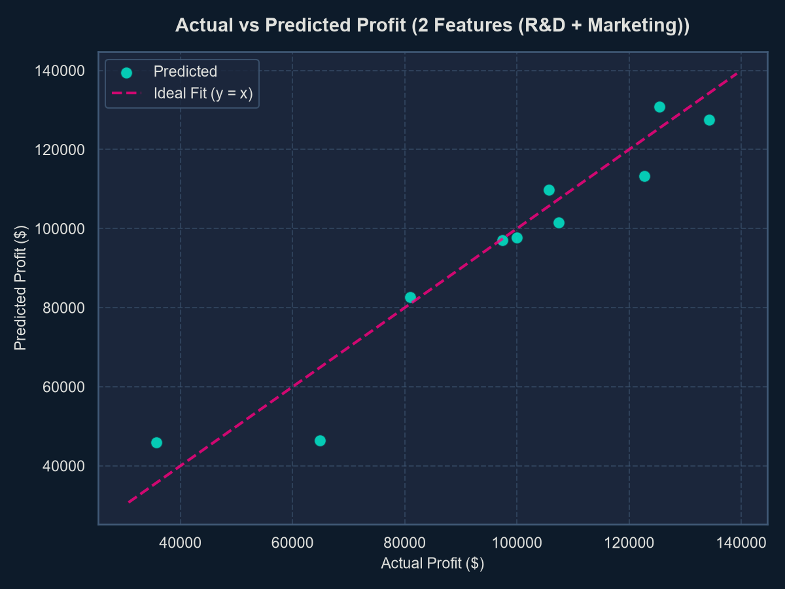
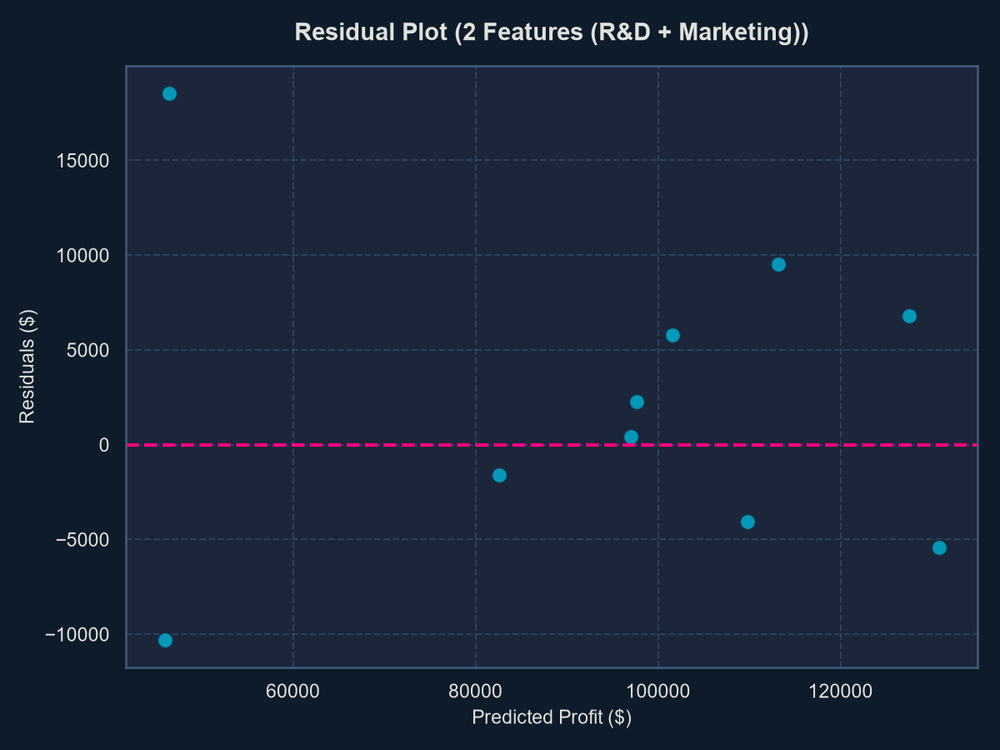

# HW6: 50 Startups Profit Prediction & CRISP-DM Workflow

本報告詳細記錄以 CRISP-DM (Cross-Industry Standard Process for Data Mining) 標準流程，對 Kaggle 50 Startups 資料集進行多元線性迴歸建模與特徵選擇的完整過程。

---

## 1. CRISP-DM 專案工作流程 (Project Workflow)

以下為本專案實作的完整 CRISP-DM 工作生命週期流程圖：

1.  **商業理解 (Business Understanding)**：定義獲利預測問題，確立以迴歸模型評估開支效益之目標。
2.  **資料理解 (Data Understanding)**：探索 50 筆 startup 數據，檢驗缺失值與重複行，繪製特徵相關性熱力圖。
3.  **資料準備 (Data Preparation)**：State 欄位獨熱編碼並剔除 California（防範共線性陷阱），分割 80/20 訓練與測試集。
4.  **建立模型 (Modeling)**：利用 Scikit-learn 訓練線性迴歸模型，對比 1 至 5 個特徵子集的預測表現。
5.  **模型評估 (Evaluation)**：實作 SFS, RFE, SelectKBest, Lasso, RandomForest 五種特徵選擇方法篩選特徵，確定最佳組合。
6.  **部署應用 (Deployment)**：將最佳模型與欄位序列化為 `.pkl` 檔，架設 Streamlit 互動平台，並編譯圖文講義 PDF。

---

## 2. 資料準備與避開 Dummy Variable Trap

在資料準備階段，類別變數 `State`（有 New York, Florida, California 三種類別）被轉化成虛擬變數 (Dummy Variables)。若同時將三個州的虛擬變數放入線性迴歸，由於其加總恆等於 1，會與模型的截距項（常數 1）產生完美多重共線性，此即 **Dummy Variable Trap**。

為防範此陷阱，我們**剔除 California 作為對照 Baseline**，僅將 `New York` 與 `Florida` 二個虛擬特徵加入變數矩陣。若兩者皆為 0 則代表 California。

---

## 3. 多模型特徵組合對比

我們訓練並測試了五種特徵組合，測試集（test_size=0.2, random_state=42）的指標結果如下：

| 模型與特徵數 | 包含特徵項目 | RMSE | MAE | R-squared | Adjusted R-squared |
| :--- | :--- | :---: | :---: | :---: | :---: |
| **1 Feature** | R&D Spend | 7714.33 | 6077.36 | 0.9265 | 0.9173 |
| **2 Features (最佳)** | R&D Spend, Marketing Spend | **8206.33** | 6469.18 | **0.9168** | **0.8931** |
| **3 Features** | R&D, Marketing, New York | 8242.78 | 6430.58 | 0.9161 | 0.8741 |
| **4 Features** | R&D, Marketing, New York, Florida | 8254.69 | 6454.51 | 0.9159 | 0.8485 |
| **5 Features** | R&D, Marketing, New York, Florida, Admin | 9055.96 | 6961.48 | 0.8987 | 0.7721 |

### 指標趨勢圖 (RMSE by Number of Features)

*分析說明*：從指標走勢可以看見，隨著特徵數從 2 個增加到 5 個（引入行政支出與州別），測試集的 RMSE 反而上升，Adjusted R-squared 從 `0.8931` 降低至 `0.7721`。這證明了**過度複雜的模型會造成過擬合 (Overfitting)**，因此精簡的二特徵模型更具備強大的泛化與預測力。

---

## 4. 特徵篩選排名與比對

本專案實作了五種篩選演算法，對五個特徵進行重要度排序（1 代表最重要）：

| 特徵項目 | SFS Forward | RFE | SelectKBest | Lasso | Random Forest | 平均排名 (Average Rank) |
| :--- | :---: | :---: | :---: | :---: | :---: | :---: |
| **R&D Spend** | 1 | 3 | 1 | 1 | 1 | **1.4 (第 1 名)** |
| **Marketing Spend** | 2 | 5 | 2 | 2 | 2 | **2.6 (第 2 名)** |
| **Florida** | 4 | 2 | 4 | 4 | 4 | **3.6** |
| **Administration** | 3 | 4 | 5 | 3 | 3 | **3.6** |
| **New York** | 5 | 1 | 3 | 5 | 5 | **3.8** |

### 特徵重要性比對熱力圖 (Heatmap)

結果證實：**R&D Spend** 與 **Marketing Spend** 為推動公司利潤最核心的兩大指標，其餘行政開支及地理州別之重要度均顯著靠後。

---

## 5. 最佳模型預測公式與殘差診斷

我們最終選定的最佳預測方程式如下：

$$\text{Profit} = 50286.8118 + 0.8056 \times (\text{R\&D Spend}) + 0.0272 \times (\text{Marketing Spend})$$

*   **截距 (Intercept)**: `50,286.8118` (基本底利)
*   **R&D Spend 係數**: `0.8056`
*   **Marketing Spend 係數**: `0.0272`

### 擬合散佈圖 (Actual vs Predicted)

### 殘差分析圖 (Residual Plot)

*診斷結論*：擬合散佈圖顯示預測點緊貼 $y=x$ 線，擬合度極佳。殘差散佈圖點狀隨機均勻分佈在 0 的兩側，無明顯異方差形態，驗證了線性迴歸模型的統計學假設基礎。

---

## 6. 專案產出檔案目錄

- **預測平台**：[streamlit_app.py](streamlit_app.py) （執行 `streamlit run streamlit_app.py` 啟動）
- **編譯講義**：[startup_profit_prediction_handout.pdf](outputs/reports/startup_profit_prediction_handout.pdf)
- **手寫風圖卡**：[image.png](image.png)
- **Draw.io 流程圖**：[docs/crisp_dm_workflow.drawio](docs/crisp_dm_workflow.drawio)
