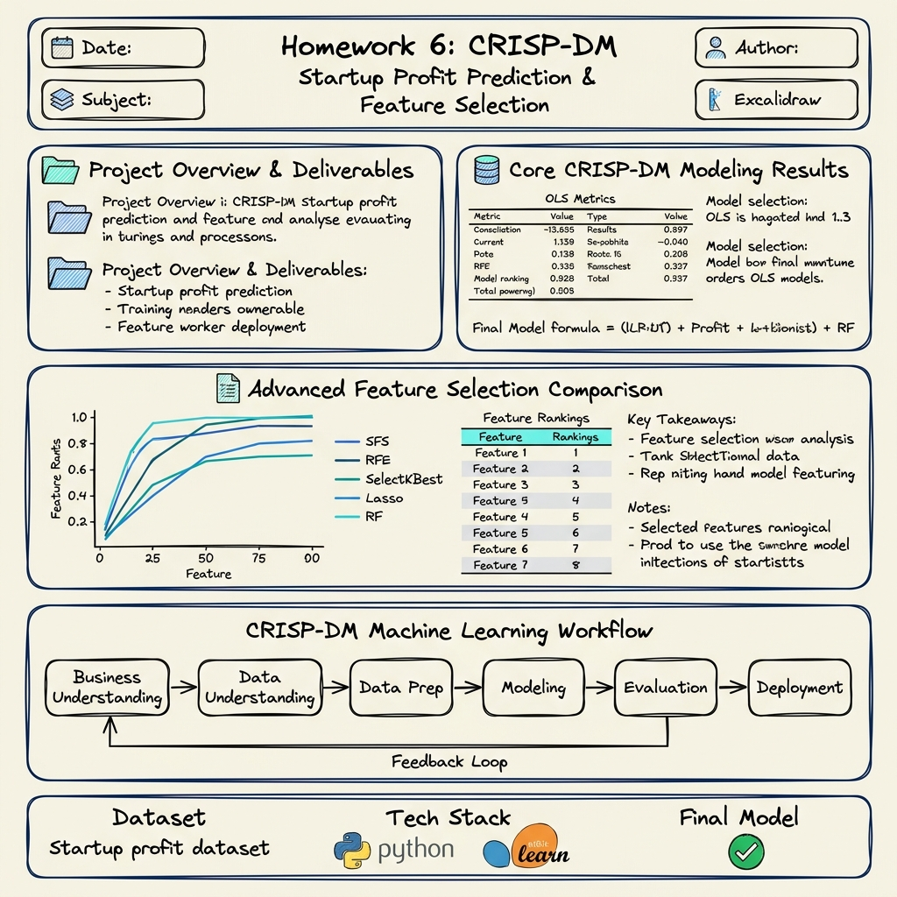

# HW6 Kaggle 50 Startups Profit Prediction



## 專案簡介

本專案使用 Kaggle 50 Startups 資料集，依照 CRISP-DM 流程建立企業獲利預測模型，並透過 Multiple Linear Regression 與特徵選擇方法分析企業獲利的主要驅動因子。

本專案不只建立預測模型，也整理出可解釋的商業洞察，協助企業了解研發支出、行銷支出、行政支出與地區因素對獲利能力的影響。

---

## 專案目標

1. 建立 50 Startups 企業獲利預測模型。
2. 使用 Multiple Linear Regression 預測 Profit。
3. 比較不同特徵組合的模型表現。
4. 使用 5 種特徵選擇方法找出重要特徵。
5. 依照 CRISP-DM 流程完成完整資料科學專案。
6. 輸出模型、圖表、報告與技術白皮書。

---

## CRISP-DM 專案流程

| 階段 | 說明 |
|---|---|
| Business Understanding | 定義企業獲利預測問題 |
| Data Understanding | 檢查資料欄位、型態、缺失值與相關性 |
| Data Preparation | One-Hot Encoding、切分訓練集與測試集 |
| Modeling | 建立多元線性迴歸模型 |
| Evaluation | 使用 RMSE、R-squared 評估模型 |
| Deployment | 輸出模型、圖表與報告 |

---

## 資料集欄位說明

| 欄位名稱 | 中文說明 | 角色 |
|---|---|---|
| R&D Spend | 研發支出 | 輸入特徵 |
| Administration | 行政支出 | 輸入特徵 |
| Marketing Spend | 行銷支出 | 輸入特徵 |
| State | 公司所在州別 | 類別特徵 |
| Profit | 公司獲利 | 預測目標 |

---

## 使用技術

| 類別 | 工具 |
|---|---|
| 程式語言 | Python |
| 資料處理 | pandas、numpy |
| 機器學習 | scikit-learn |
| 視覺化 | matplotlib、seaborn |
| 模型儲存 | joblib |
| 專案流程 | CRISP-DM |

---

## 模型方法

本專案使用：

- **Multiple Linear Regression 多元線性迴歸**
  - 使用 `sklearn.linear_model.LinearRegression` 作為預測基準。
  - 對 1 至 5 個特徵的多個組合進行訓練並評估性能。

---

## 安裝與執行方式 (Installation & Execution)

### 1. 安裝環境套件
專案支援 Windows 系統。請先安裝好 Python 環境，並於根目錄執行：
```bash
pip install -r requirements.txt
```

### 2. 執行預測管線
請執行以下指令，系統將會全自動完成所有的 CRISP-DM 流程（包括下載數據、前處理、訓練、評估、產出報告與圖表）：
```bash
python run_project.py
```

---

## 模型結果摘要 (Model Results Summary)

我們已透過測試集驗證（`test_size = 0.2`, `random_state = 42`），選出了表現最佳的模型：

- **最佳特徵組合 (Best Features)**：`R&D Spend + Marketing Spend` (2 Features)
- **測試集預測表現**：
  - **RMSE** (均方根誤差)：`8206.3288`
  - **R-squared** (決定係數)：`0.9168` (在訓練集上可達 `0.9519`)
- **最終模型公式 (Model Formula)**：
  $$\text{Profit} = 50286.8118 + 0.8056 \times (\text{R\&D Spend}) + 0.0272 \times (\text{Marketing Spend})$$

---

## 輸出檔案說明 (Output Files)

### 1. 視覺化圖表 (`outputs/figures/`)
- `rmse_by_features.png`：不同特徵數量下的 RMSE 變化折線圖。
- `r2_by_features.png`：不同特徵數量下的 R-squared 與 Adjusted R-squared 對比圖。
- `feature_selection_performance.png`：特徵選擇效能曲線（雙軸圖）。
- `feature_selection_comparison.png`：五種特徵選擇方法之排名熱力圖。
- `actual_vs_predicted.png`：最佳模型預測值 vs 真實值的散佈圖。
- `residual_plot.png`：最佳模型殘差圖。
- `correlation_heatmap.png`：完整特徵關聯性熱力圖。

### 2. 模型檔案 (`outputs/models/`)
- `startup_profit_model_v2.pkl`：使用 `joblib` 序列化的最佳模型檔案。
- `feature_columns.pkl`：最佳模型的輸入特徵順序清單 (`['R&D Spend', 'Marketing Spend']`)。

### 3. 文字與數據報告 (`outputs/reports/`)
- `data_understanding_report.txt`：資料集描述性統計與重整報告。
- `model_comparison.csv` 與 `model_comparison.txt`：5 組模型指標的詳細比對表格。
- `feature_selection_ranking.csv`：5 種特徵選擇方法的特徵排名表格。
- `feature_selection_summary.txt`：特徵重要性的詳細文字分析。